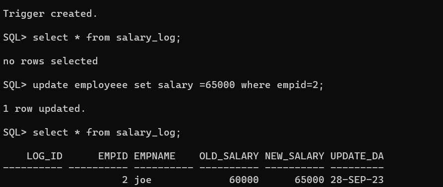

# Ex. No: 5 Creating Triggers using PL/SQL
## DATE:
### AIM: 
To create a Trigger using PL/SQL.
### Algorithm/Procedure:
1. Create employee table with following attributes (empid NUMBER, empname VARCHAR(10), dept VARCHAR(10),salary NUMBER);
2. Create salary_log table with following attributes (log_id NUMBER GENERATED ALWAYS AS IDENTITY, empid NUMBER,empname VARCHAR(10),old_salary NUMBER,new_salary NUMBER,update_date DATE);
3. Create a trigger named as log_salary-update.
4. Inside the trigger block, Insert the values into the salary_log table whenever the salary is updated.
5. End the trigger.
6. Update the salary of an employee in employee table.
7. Whenever a salary is updated for the employee it must be logged into the salary_log table with old salary and new salary.
8. Display the employee table, salary_log table.
### Program:
### Create employee table
create table employee(empid NUMBER, empname VARCHAR(10), dept VARCHAR(10),salary NUMBER);
### Create salary_log table
Create salary_log table (log_id NUMBER , empid NUMBER,empname VARCHAR(10),old_salary NUMBER,new_salary NUMBER,update_date DATE);
### PLSQL Trigger code
```sql
create or replace trigger log_salary_update
before update on employee
for each row
declare
v_old_salary NUMBER;
v_new_salary NUMBER;
begin
v_old_salary:= :old.salary;
v_new_salary:= :new.salary;
if v_old_salary <> v_new_salary then
insert into salary_log (empid, empname, old_salary, new_salary, update_date)
values(:old.empid, :old.empname, v_old_salary, v_new_salary, sysdate);
end if;
end;
/
```
### Output:

## Result:
Thus the trigger using pl/sql has been created sucessfully.
